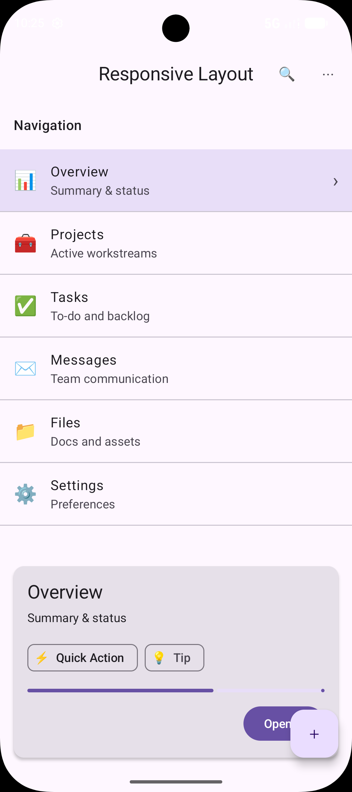
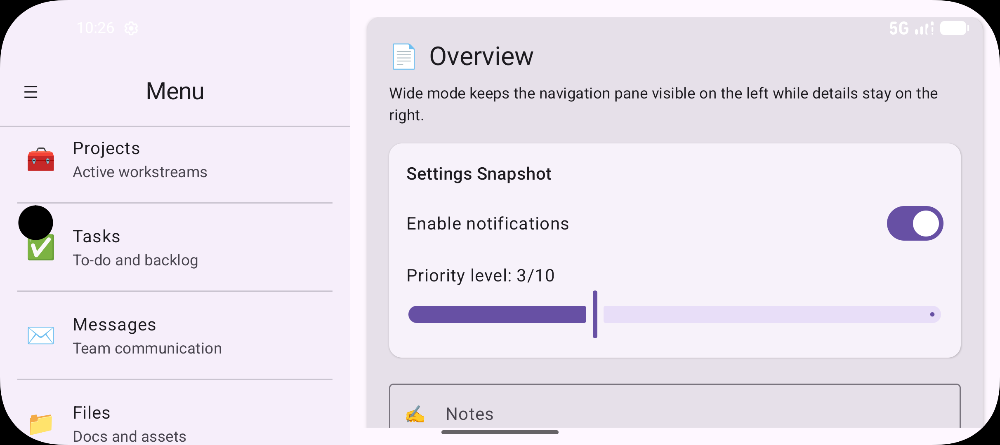

# Q4 Responsive Layout Challenge: Phone vs Tablet

## Overview

This project implements **one Compose screen** that adapts layout based on width.

The screen supports:

- Phone (narrow): **single Column** layout
- Tablet / landscape (wide): **Row with two panes**
  - Left pane: navigation/options list (Column + LazyColumn)
  - Right pane: detail content (Box + Column mixed)
- Responsive breakpoint based on window width
- Correct use of `weight()` and `fillMaxHeight()`
- Scroll behavior using **LazyColumn** and **verticalScroll**
- Uses **Material 3** components (6+)

---

## Responsive Breakpoint Logic

This implementation uses `LocalConfiguration` to compute a breakpoint at **600dp**:

```kotlin
val screenWidthDp = LocalConfiguration.current.screenWidthDp
val isWide = screenWidthDp >= 600
```

## Material 3 Components Used

The screen includes the following Material 3 components:

- Scaffold
- CenterAlignedTopAppBar
- FloatingActionButton
- ListItem
- Card
- ElevatedCard
- AssistChip
- SuggestionChip
- LinearProgressIndicator
- Switch
- Slider
- OutlinedTextField
- Button
- OutlinedButton
- Divider


## Screenshots

Below is the screenshot of the app:

**Phone Screen**
   

**Tablet Screen**
   

## How to Run

1. Open the project in Android Studio  
2. Use an emulator with API 34  
3. Run `MainActivity`  

## AI Disclosure
